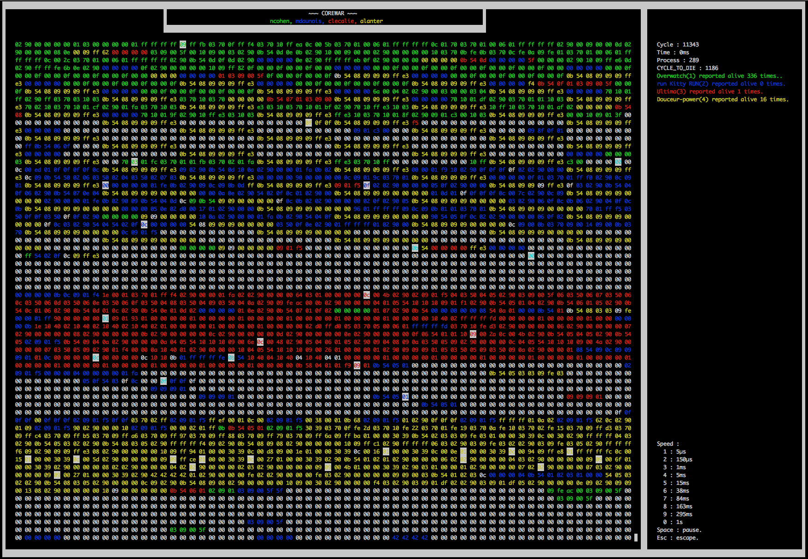

# Corewar 

## Pitch

Corewar is a pedagogical project from 42 School which aims to introduce the students to Virtual Machines and assembler.  
In this project, you create a virtual “arena” in which programs will fight against one another (the “Champions”). You also create an assembler to compile
those Champions as well as a Champione.

## Main features

- Compile asm from file in .s to file in .cor
- Emulate a virtual machine
- Run programs and processus until the last process die

## Things I have learned

- Better understanding of the C programming language and how to structure the code to keep a growing program maintanable, and open to new features.
- Mecanism of a CPU.
- Working in groups, being well organized.
- Writting a script to automatise testing.

## Compile and run

Start compiling using make.
 
Then run './asm \<file.s\>' using the champs file in champs.
 
You can then run './corewar \<file.cor\>' using -v for visualiser
 
example :
	
	make
	./asm champs/examples/zork.s
	./corewar -v champs/examples/zork.cor champs/examples/zork.cor

If visualiser is having a problem of space, launch in full screen or use "cmd + '-' " or "ctrl + '-' "

## Keys

- 0 - 9 : Define speed
- space : pause
- \<esc\> : Quit

## Script

Full testing script :

- Initialize from ressources (already done for github)
- Compile with static analyzer
- Make ./asm on all files in ./champs/
- Check for leaks
- Check for diff with example file from "zaz"
- Remove all .cor
- Choose specific path

- Specific report for each test.

Run with -h to see flags

	./script.sh -h

